# Domain Adaptation Architecture Documentation

> **Note:** Individual diagrams are available as separate `.mmd` files in the [`diagrams/`](diagrams/) folder for direct viewing on GitHub.

## Proposed Model Name

### **AdaptBMA** (Adaptive Bag-based Multi-instance Aggregation)

**Alternative Names:**
- **DA-BMA-MIL**: Domain Adapted Bag-based Multiple Instance Learning
- **TRIAD-MIL**: Triple-Regularized Invariant Adaptation for Domain transfer in MIL
- **DAMN-MIL**: Domain Adaptive Multi-scale Network for Multiple Instance Learning

**Recommended: AdaptBMA** - Short, memorable, and clearly indicates domain adaptation + BMA approach.

---

## Architecture Diagrams

> 💡 **View on GitHub:** All diagrams are available as individual `.mmd` files in the [`diagrams/`](diagrams/) folder with automatic Mermaid rendering.

### 1. High-Level System Architecture

📄 [View diagram file](diagrams/01_high_level_architecture.mmd)

```mermaid
graph TB
    subgraph "Data Input"
        QLD1[QLD1 Source Domain<br/>60 images, 12 piles<br/>3 classes]
        QLD2[QLD2 Target Domain<br/>48 images, 12 piles<br/>3 classes]
    end

    subgraph "Preprocessing"
        PE1[Patch Extraction<br/>12 patches per image<br/>1008×1008 → 224×224]
        PE2[Patch Extraction<br/>12 patches per image<br/>1008×1008 → 224×224]
    end

    subgraph "AdaptBMA Model"
        FE[Feature Extractor<br/>ViT-R50<br/>768-dim features]
        AGG[Attention Aggregator<br/>512-dim bag features]
        CLS[Classifier Head<br/>3 classes]

        subgraph "Domain Adaptation"
            GRL[Gradient Reversal<br/>Layer λ=1.0]
            DISC[Domain Discriminator<br/>Spectral Norm]
        end
    end

    subgraph "Loss Components"
        L_CLS[Classification Loss<br/>CrossEntropy]
        L_ADV[Adversarial Loss<br/>DANN + GRL]
        L_MMD[MMD Loss<br/>Class-Conditional<br/>Multi-kernel RBF]
        L_ORTH[Orthogonal Loss<br/>Weight Decoupling]
    end

    subgraph "Training & Validation"
        OPT[Optimizer<br/>AdamW + ReduceLR]
        VAL[Pile-Level Validation<br/>Mean Pooling]
        SAVE[Best Model<br/>Target F1]
    end

    QLD1 --> PE1
    QLD2 --> PE2
    PE1 --> FE
    PE2 --> FE
    FE --> AGG
    AGG --> CLS
    AGG --> GRL
    GRL --> DISC

    CLS --> L_CLS
    DISC --> L_ADV
    AGG --> L_MMD
    CLS --> L_ORTH
    DISC --> L_ORTH

    L_CLS --> OPT
    L_ADV --> OPT
    L_MMD --> OPT
    L_ORTH --> OPT

    OPT --> VAL
    VAL --> SAVE

    style AdaptBMA fill:#e1f5ff
    style "Domain Adaptation" fill:#fff4e1
    style "Loss Components" fill:#ffe1e1
    style SAVE fill:#e1ffe1
```

---

### 2. Detailed Model Architecture

📄 [View diagram file](diagrams/02_detailed_model_architecture.mmd)


---

### 3. Domain Adaptation Training Flow

📄 [View diagram file](diagrams/03_training_flow.mmd)

```mermaid
flowchart TD
    START([Training Start<br/>Epoch e=0])

    subgraph "Data Loading"
        SRC_BATCH[Load Source Batch<br/>QLD1: n samples]
        TGT_BATCH[Load Target Batch<br/>QLD2: n samples]
    end

    subgraph "Forward Pass"
        FWD_SRC[Forward Source<br/>logits_s, z_s, d_s]
        FWD_TGT[Forward Target<br/>logits_t, z_t, d_t]
    end

    subgraph "Loss Computation"
        RAMP{Compute Rampup<br/>λ = e/5 if e<5<br/>else 1.0}

        CLS_SRC[L_cls_src = CE(logits_s, y_s)]
        CLS_TGT[L_cls_tgt = CE(logits_t, y_t)]
        CLS_TOTAL[L_cls = L_cls_src + L_cls_tgt]

        ADV_SRC[L_adv_src = BCE(d_s, 0)]
        ADV_TGT[L_adv_tgt = BCE(d_t, 1)]
        ADV_TOTAL[L_adv = L_adv_src + L_adv_tgt]

        MMD_CALC[L_mmd = Class-Cond-MMD(z_s, z_t)]

        ORTH_CALC[L_orth = ||W_cls·W_dom^T||_F]

        TOTAL[L_total = L_cls +<br/>λ_adv·L_adv +<br/>λ_mmd·L_mmd +<br/>λ_orth·L_orth]
    end

    subgraph "Optimization"
        BACKWARD[Backward Pass<br/>Compute Gradients]
        CLIP[Gradient Clipping<br/>max_norm=5.0]
        STEP[Optimizer Step<br/>Update Weights]
    end

    subgraph "Validation"
        VAL_SRC[Validate Source<br/>Pile-level metrics]
        VAL_TGT[Validate Target<br/>Pile-level metrics]
        METRICS[Compute Metrics<br/>Acc, F1 per domain]
    end

    subgraph "Checkpoint"
        CHECK{Target F1<br/>improved?}
        SAVE[Save Best Model<br/>+ History]
    end

    START --> SRC_BATCH & TGT_BATCH
    SRC_BATCH --> FWD_SRC
    TGT_BATCH --> FWD_TGT

    FWD_SRC & FWD_TGT --> RAMP

    RAMP --> CLS_SRC & CLS_TGT
    CLS_SRC & CLS_TGT --> CLS_TOTAL

    RAMP --> ADV_SRC & ADV_TGT
    ADV_SRC & ADV_TGT --> ADV_TOTAL

    RAMP --> MMD_CALC
    RAMP --> ORTH_CALC

    CLS_TOTAL & ADV_TOTAL & MMD_CALC & ORTH_CALC --> TOTAL

    TOTAL --> BACKWARD
    BACKWARD --> CLIP
    CLIP --> STEP

    STEP --> VAL_SRC & VAL_TGT
    VAL_SRC & VAL_TGT --> METRICS

    METRICS --> CHECK
    CHECK -->|Yes| SAVE
    CHECK -->|No| NEXT
    SAVE --> NEXT

    NEXT{More<br/>Epochs?}
    NEXT -->|Yes| START
    NEXT -->|No| END([Training Complete])

    style TOTAL fill:#ffcccc
    style SAVE fill:#ccffcc
    style RAMP fill:#ffffcc
```

---

### 4. Loss Component Details

📄 [View diagram file](diagrams/04_loss_components.mmd)

```mermaid
graph TB
    subgraph "L_cls: Classification Loss"
        CLS_IN[Source logits + Target logits<br/>Source labels + Target labels]
        CLS_CE1[CE_source = -Σ y_s·log(σ(logits_s))]
        CLS_CE2[CE_target = -Σ y_t·log(σ(logits_t))]
        CLS_OUT[L_cls = CE_source + CE_target]
        CLS_IN --> CLS_CE1 & CLS_CE2
        CLS_CE1 & CLS_CE2 --> CLS_OUT
    end

    subgraph "L_adv: Adversarial Loss DANN"
        ADV_IN[z_s, z_t through GRL]
        GRL_OP[GRL: Forward=Identity<br/>Backward=-λ·grad]
        DISC_OP[Domain Discriminator<br/>Spectral Norm MLP]
        ADV_BCE[BCE with Label Smoothing<br/>Source→0, Target→1]
        ADV_OUT[L_adv = BCE(d_s, 0) + BCE(d_t, 1)]
        ADV_IN --> GRL_OP
        GRL_OP --> DISC_OP
        DISC_OP --> ADV_BCE
        ADV_BCE --> ADV_OUT
    end

    subgraph "L_mmd: Maximum Mean Discrepancy"
        MMD_IN[z_s: Source features<br/>z_t: Target features<br/>y_s, y_t: Labels]
        MMD_SPLIT[Split by Class<br/>c ∈ {1,2,3}]
        MMD_KERNEL[Multi-kernel RBF<br/>σ ∈ {0.5, 1.0, 2.0, 4.0}]
        MMD_CALC[MMD²_c = E[k(x,x')] +<br/>E[k(y,y')] - 2E[k(x,y)]]
        MMD_SUM[Sum over classes & kernels]
        MMD_OUT[L_mmd = Σ_c Σ_σ MMD²_c,σ]
        MMD_IN --> MMD_SPLIT
        MMD_SPLIT --> MMD_KERNEL
        MMD_KERNEL --> MMD_CALC
        MMD_CALC --> MMD_SUM
        MMD_SUM --> MMD_OUT
    end

    subgraph "L_orth: Orthogonal Regularization"
        ORTH_IN[W_cls: Classifier weights<br/>W_dom: Discriminator weights]
        ORTH_PROD[Product: W_cls·W_dom^T]
        ORTH_NORM[Frobenius Norm<br/>||·||_F]
        ORTH_SCALE[Normalize by<br/>||W_cls||_F·||W_dom||_F]
        ORTH_OUT[L_orth = ||W_cls·W_dom^T||²_F /<br/>(||W_cls||_F·||W_dom||_F)]
        ORTH_IN --> ORTH_PROD
        ORTH_PROD --> ORTH_NORM
        ORTH_NORM --> ORTH_SCALE
        ORTH_SCALE --> ORTH_OUT
    end

    style CLS_OUT fill:#99ccff
    style ADV_OUT fill:#ffcc99
    style MMD_OUT fill:#ff9999
    style ORTH_OUT fill:#99ff99
```

---

### 5. Training Strategy Overview

📄 [View diagram file](diagrams/05_training_strategy.mmd)

```mermaid
timeline
    title AdaptBMA Training Strategy

    section Phase 1: Warmup (Epochs 0-2)
        Ramp-up Adaptation : λ_adv: 0.0 → 0.4
                           : λ_mmd: 0.0 → 0.4
                           : λ_grl: 0.0 → 0.4
        Focus : Classification on both domains
              : Gentle introduction of adaptation

    section Phase 2: Adaptation (Epochs 3-5)
        Full Adaptation : λ_adv: 0.4 → 1.0
                        : λ_mmd: 0.4 → 0.5
                        : λ_grl: 0.4 → 1.0
        Focus : Domain confusion via DANN
              : Distribution alignment via MMD
              : Feature orthogonality

    section Phase 3: Fine-tuning (Epochs 6+)
        Stable Training : All λ values constant
                        : λ_adv = 1.0
                        : λ_mmd = 0.5
                        : λ_orth = 0.01
        Focus : Convergence
              : Target domain improvement
              : Source domain preservation

    section Validation
        Every Epoch : Bag-level predictions
                    : Pile-level aggregation
                    : Source & Target metrics
        Early Stop : Monitor Target F1
                   : Patience = 10 epochs
                   : Save best model
```

---

### 6. Data Flow Pipeline

📄 [View diagram file](diagrams/06_data_pipeline.mmd)

```mermaid
graph TD
    subgraph "Data Preparation"
        CSV1[QLD1 CSV<br/>pile, image_path, label]
        CSV2[QLD2 CSV<br/>pile, image_path, label]

        SPLIT1[Train/Val Split<br/>70/30 at pile-level]
        SPLIT2[Train/Val Split<br/>70/30 at pile-level]

        DS1_TR[QLD1 Train Dataset<br/>40 bags]
        DS1_VAL[QLD1 Val Dataset<br/>20 bags]
        DS2_TR[QLD2 Train Dataset<br/>32 bags]
        DS2_VAL[QLD2 Val Dataset<br/>16 bags]
    end

    subgraph "DataLoaders"
        DL1_TR[Source Train Loader<br/>Batch=2, Shuffle=True]
        DL1_VAL[Source Val Loader<br/>Batch=2, Shuffle=False]
        DL2_TR[Target Train Loader<br/>Batch=2, Shuffle=True]
        DL2_VAL[Target Val Loader<br/>Batch=2, Shuffle=False]
    end

    subgraph "Batch Processing"
        SYNC[Synchronized Iteration<br/>max(len(src), len(tgt))]
        CYCLE[Cycle shorter loader]
    end

    subgraph "Training"
        TRAIN[Forward → Loss → Backward → Step]
        VAL[Validate Both Domains]
    end

    CSV1 --> SPLIT1
    CSV2 --> SPLIT2
    SPLIT1 --> DS1_TR & DS1_VAL
    SPLIT2 --> DS2_TR & DS2_VAL

    DS1_TR --> DL1_TR
    DS1_VAL --> DL1_VAL
    DS2_TR --> DL2_TR
    DS2_VAL --> DL2_VAL

    DL1_TR & DL2_TR --> SYNC
    SYNC --> CYCLE
    CYCLE --> TRAIN

    DL1_VAL & DL2_VAL --> VAL

    TRAIN --> VAL

    style TRAIN fill:#ffcccc
    style VAL fill:#ccffcc
    style SYNC fill:#ffffcc
```

---

### 7. Gradient Reversal Layer Mechanism

📄 [View diagram file](diagrams/07_gradient_reversal.mmd)

```mermaid
graph LR
    subgraph "Forward Pass"
        F_IN[Input: z<br/>512-dim features]
        F_IDEN[Identity: y = x]
        F_OUT[Output: z<br/>Unchanged]
        F_IN --> F_IDEN
        F_IDEN --> F_OUT
    end

    subgraph "Backward Pass"
        B_IN[Gradient: ∂L/∂z]
        B_REV[Reverse: -λ·∂L/∂z]
        B_OUT[Updated: -λ·∂L/∂z]
        B_IN --> B_REV
        B_REV --> B_OUT
    end

    subgraph "Effect"
        EFF1[Discriminator tries to<br/>classify domains correctly]
        EFF2[Feature extractor receives<br/>reversed gradients]
        EFF3[Features become<br/>domain-invariant]
        EFF1 --> EFF2
        EFF2 --> EFF3
    end

    F_OUT -.->|Training| B_IN
    B_OUT -.->|Affects| EFF1

    style F_IDEN fill:#ccffcc
    style B_REV fill:#ffcccc
    style EFF3 fill:#ffffcc
```



---

### 8. Evaluation Pipeline

📄 [View diagram file](diagrams/08_evaluation_pipeline.mmd)

```mermaid
graph TD
    subgraph "Bag-Level Prediction"
        BAG1[Bag 1: Image A<br/>12 patches]
        BAG2[Bag 2: Image B<br/>12 patches]
        BAG3[Bag 3: Image C<br/>12 patches]
        BAGN[Bag n: Image N<br/>12 patches]

        PRED1[Prediction: p1<br/>3-class probs]
        PRED2[Prediction: p2<br/>3-class probs]
        PRED3[Prediction: p3<br/>3-class probs]
        PREDN[Prediction: pn<br/>3-class probs]
    end

    subgraph "Pile-Level Aggregation"
        GROUP[Group by pile_id<br/>Pile X: {p1, p2, p3}]
        POOL[Mean Pooling<br/>p_pile = mean(p1, p2, p3)]
        ARGMAX[Final Prediction<br/>class = argmax(p_pile)]
    end

    subgraph "Metrics"
        ACC[Pile-level Accuracy]
        F1W[Weighted F1-Score]
        F1C[Per-class F1-Score]
        CM[Confusion Matrix]
    end

    BAG1 --> PRED1
    BAG2 --> PRED2
    BAG3 --> PRED3
    BAGN --> PREDN

    PRED1 & PRED2 & PRED3 & PREDN --> GROUP
    GROUP --> POOL
    POOL --> ARGMAX

    ARGMAX --> ACC & F1W & F1C & CM

    style POOL fill:#ffeb99
    style ARGMAX fill:#99ff99
    style F1W fill:#99ccff
```

---

## Key Design Decisions

### 1. **Why Three Adaptation Techniques?**
- **DANN**: Domain-invariant features via adversarial learning
- **MMD**: Explicit distribution alignment with theoretical guarantees
- **Orthogonal**: Prevents domain features from corrupting task features

### 2. **Why Ramp-up Schedules?**
- Prevents early collapse of domain discriminator
- Allows classification to establish before adaptation
- Gradual introduction improves stability

### 3. **Why Class-Conditional MMD?**
- Aligns distributions per-class, not globally
- Preserves class boundaries during adaptation
- Better for labeled target domain

### 4. **Why Spectral Normalization?**
- Stabilizes discriminator training
- Prevents mode collapse
- Lipschitz constraint improves convergence

### 5. **Why Bag-Level Training?**
- Aligns with existing pipeline
- More training samples than pile-level
- Pile aggregation at evaluation preserves final metrics

---

## Model Naming Rationale

**AdaptBMA** (Recommended)

**Acronym Breakdown:**
- **Adapt**: Domain Adaptation capability
- **B**: Bag-based (MIL paradigm)
- **M**: Multi-instance
- **A**: Aggregation (attention mechanism)

**Benefits:**
- Short and memorable
- Clearly conveys both MIL and adaptation
- Professional naming convention
- Suitable for publication

**Full Name:** Adaptive Bag-based Multi-instance Aggregation for Cross-Domain Biological Assessment

---

## Summary Statistics

| Component | Details |
|-----------|---------|
| **Model Name** | AdaptBMA |
| **Total Parameters** | 99,204,421 |
| **Trainable Parameters** | 1,314,309 (frozen backbone) |
| **Loss Components** | 4 (Classification, Adversarial, MMD, Orthogonal) |
| **Hyperparameters** | 15+ configurable |
| **Adaptation Techniques** | 3 (DANN, MMD, Orthogonal) |
| **Training Levels** | Bag-level (image) |
| **Evaluation Levels** | Pile-level (aggregated) |
| **Domains** | 2 (QLD1 source, QLD2 target) |
| **Architecture Style** | Modular, extensible |

---

This documentation provides a complete visual understanding of the AdaptBMA architecture and training strategy!
